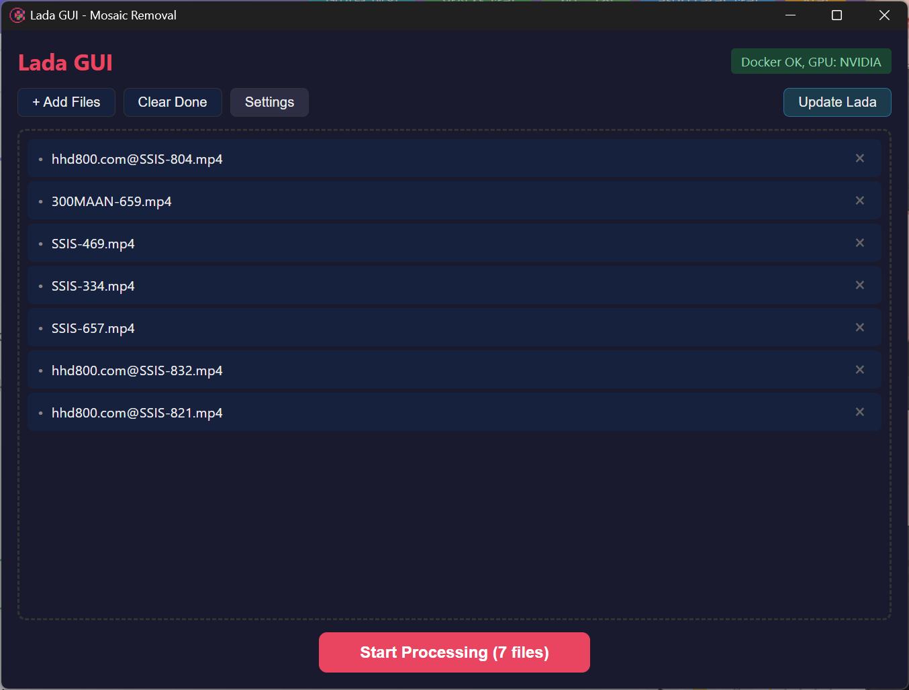
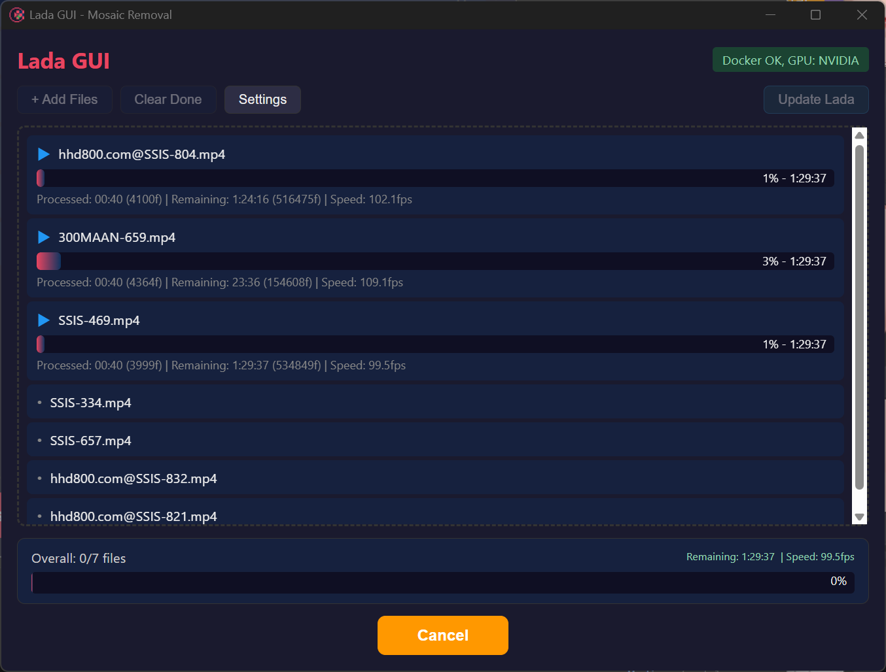
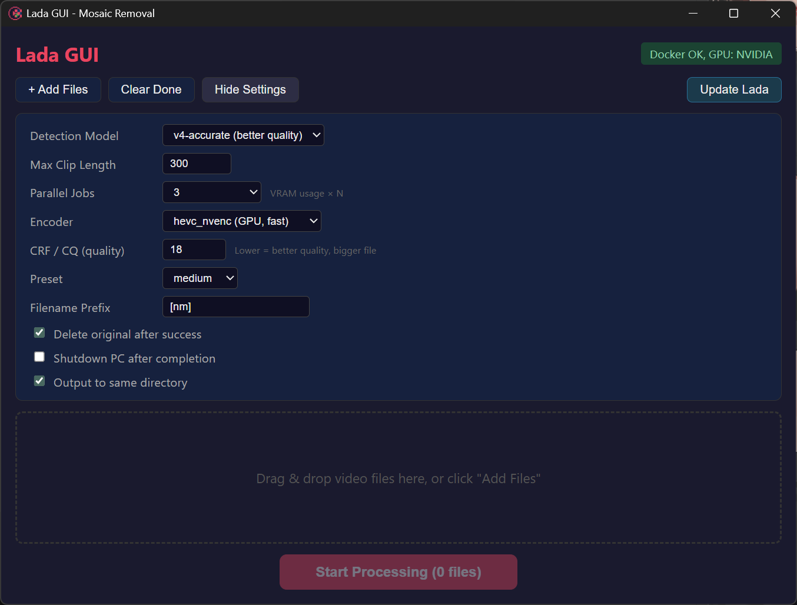

# Lada GUI

AI 기반 동영상 모자이크 제거 도구 [Lada](https://github.com/ladaapp/lada)의 GUI 래퍼 애플리케이션.

Tauri + Svelte로 구현된 경량 데스크탑 앱 (~2.6MB)으로, Docker에서 Lada를 실행하고 진행률을 실시간으로 표시합니다.

## Screenshots

| 파일 추가 | 병렬 처리 중 | 설정 |
|:-:|:-:|:-:|
|  |  |  |

## Features

- 파일 드래그앤드롭 / 추가 버튼으로 작업 큐 관리
- 실시간 프로그레스바 (잔여시간, 속도 표시)
- GPU 인코딩 (NVENC) 지원 - CPU 부하 최소화
- 병렬 처리 (동시 1~4개 파일)
- 실패 시 자동 재시도 (무한, 로그 기록)
- 완료 후 원본 삭제 옵션
- 완료 후 PC 자동 종료 옵션
- 출력 경로 / 파일명 접두사 설정
- Lada Docker 이미지 원클릭 업데이트

## 사전 준비 (필수)

### 1. NVIDIA GPU 드라이버

NVIDIA GPU가 필요합니다. 최신 드라이버를 설치하세요.

- [NVIDIA 드라이버 다운로드](https://www.nvidia.com/Download/index.aspx)
- 드라이버 버전 570.0 이상 권장 (NVENC 지원)

### 2. Docker Desktop 설치

Docker Desktop이 필요합니다. Lada는 Docker 컨테이너로 실행됩니다.

1. [Docker Desktop](https://www.docker.com/products/docker-desktop/) 다운로드 및 설치
2. 설치 시 **WSL 2 backend** 사용 (기본값)
3. 설치 후 Docker Desktop 실행

### 3. Docker Desktop GPU 설정

Docker에서 GPU를 사용하려면 추가 설정이 필요합니다.

1. Docker Desktop 실행
2. Settings > Resources > WSL Integration 에서 사용 중인 WSL 배포판 활성화
3. Settings > Docker Engine 에서 아래 내용이 있는지 확인:
   ```json
   {
     "runtimes": {
       "nvidia": {
         "path": "nvidia-container-runtime",
         "runtimeArgs": []
       }
     }
   }
   ```
   없다면 [NVIDIA Container Toolkit](https://docs.nvidia.com/datacenter/cloud-native/container-toolkit/latest/install-guide.html) 설치가 필요합니다.

### 4. Lada Docker 이미지 다운로드

첫 실행 전에 Lada 이미지를 미리 받아두면 좋습니다 (~14GB):

```bash
docker pull ladaapp/lada:latest
```

또는 앱 내 **Update Lada** 버튼으로도 다운로드 가능합니다.

### 5. GPU 동작 확인 (선택)

설정이 올바른지 확인:

```bash
docker run --rm --gpus all ladaapp/lada:latest nvidia-smi
```

GPU 정보가 표시되면 정상입니다.

## 설치 및 실행

1. [Releases](https://github.com/rhupy/lada/releases)에서 `Lada GUI_x.x.x_x64-setup.exe` 다운로드
2. 설치 후 실행
3. 우측 상단에 `Docker OK, GPU: NVIDIA` 표시 확인
4. 동영상 파일을 드래그하거나 Add Files로 추가
5. Start Processing 클릭

## Settings 설명

| 설정 | 기본값 | 설명 |
|------|--------|------|
| Detection Model | v4-accurate | `v4-fast`: 빠름, `v4-accurate`: 정확함 |
| Max Clip Length | 300 | 긴 영상을 N초 단위로 분할 처리 (VRAM 부족 시 줄이기) |
| Parallel Jobs | 1 | 동시 처리 파일 수 (VRAM 여유 시 2~4) |
| Encoder | hevc_nvenc | GPU 인코딩. GPU 없으면 `libx265` 선택 |
| CRF / CQ | 18 | 품질 (낮을수록 고품질, 큰 파일) |
| Preset | medium | 인코딩 속도 vs 품질 |
| Filename Prefix | [nm] | 출력 파일명 앞에 붙는 접두사 |
| Delete original | On | 성공 시 원본 파일 삭제 |
| Shutdown after | Off | 모든 파일 완료 후 PC 종료 |
| Output to same directory | On | 원본과 같은 폴더에 출력 |

## 권장 설정 (GPU별)

### RTX 5090 / 4090 (VRAM 24~32GB)
- Parallel Jobs: 2~4
- Encoder: hevc_nvenc
- Max Clip Length: 300~600

### RTX 4070 / 3070 (VRAM 8~12GB)
- Parallel Jobs: 1~2
- Encoder: hevc_nvenc
- Max Clip Length: 120~300

### GPU 없음 / 저사양
- Parallel Jobs: 1
- Encoder: libx265
- Max Clip Length: 60~120

## 로그

처리 실패/재시도 로그는 앱 설치 경로의 `lada-gui.log`에 기록됩니다.

## 문제 해결

### "Docker OK, GPU: not detected"
- Docker Desktop이 실행 중인지 확인
- NVIDIA 드라이버가 설치되어 있는지 확인
- Docker Desktop 재시작 후 다시 시도

### 처리 시작 후 바로 실패 (exit code 125)
- Docker Desktop의 GPU 지원이 활성화되어 있는지 확인
- `docker run --rm --gpus all ladaapp/lada:latest nvidia-smi` 테스트

### hevc_nvenc 인코더 오류
- Encoder를 `libx265`로 변경하여 테스트
- NVIDIA 드라이버 570.0 이상 필요

### 처리 중 멈춤
- 앱은 프로세스가 살아있는 한 무한 대기합니다
- Cancel 후 다시 시작해보세요
- 재시도 시 자동으로 처리됩니다

## Tech Stack

- **Frontend**: Svelte 5
- **Backend**: Rust (Tauri v2)
- **AI Engine**: [Lada](https://github.com/ladaapp/lada) (Docker)
- **Build**: ~2.6MB Windows installer

## Development

```bash
cd src

# Install dependencies
npm install

# Run in development mode
npm run tauri dev

# Build for production
npm run tauri build
```

## License

MIT
